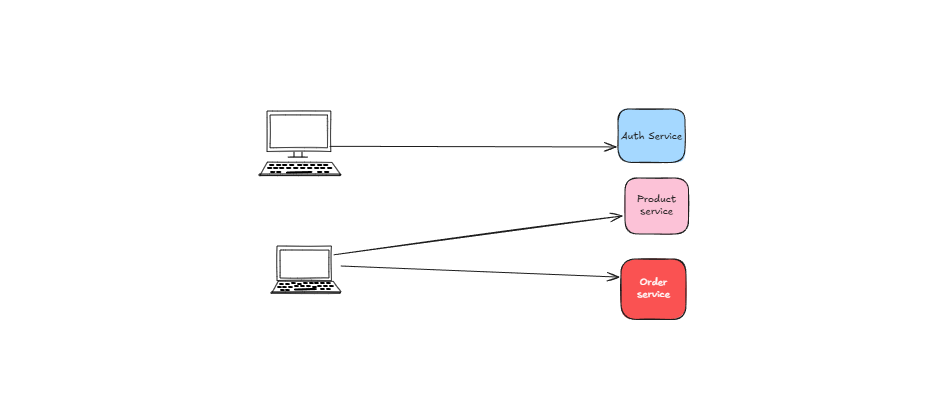
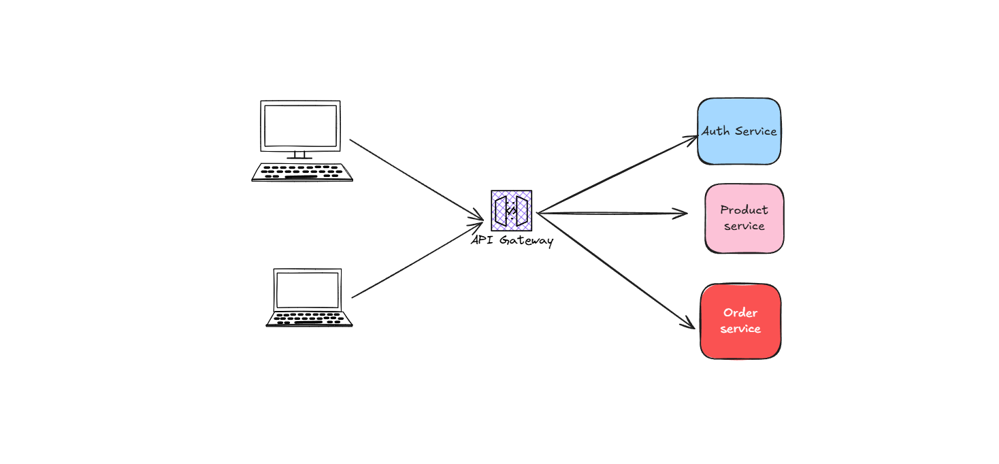
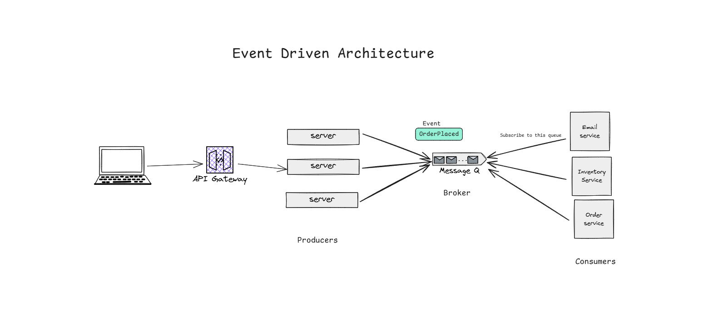

# Client Server Architecture

## Overview

- **Client:** The user's device or app (browser, mobile app, desktop app, TV, etc.)
- **Server:** The backend system (APIs, databases, business logic)

Clients and servers are separate. The client asks for data or actions, and the server responds. All types of clients make similar requests and get similar responses.

Usually, there are multiple frontend teams (for different clients) and one backend team.

### Why This Works Well

- Clear separation between frontend and backend
- Clients and servers can be updated independently
- One server can handle requests from many clients

---

## Stateless Protocol

A stateless protocol means:

> [!NOTE]
> **Each request is independent.**
> The server does not remember previous requests.

### Benefits

- Simpler server design
- Easier to scale (add more servers)
- No need to store session data on the server

> **If you need to remember things:**
> - Store data on the client (cookies, JWT)
> - Use a database or cache (like Redis)

---

## Request-Response Cycle

This is how clients and servers communicate:

1. Client sends a request (GET, POST, etc.)
2. Server receives the request, processes it, and may access a database
3. Server sends back a response (JSON, HTML, etc.)

**Example:**
```http
GET /api/users/123
```

---

## API Gateway Pattern

An API gateway is a single entry point for all client requests. It sits in front of your backend or microservices and manages incoming requests.

##### Instead of:


##### you can do:


### Why its important
- Central Place for **Auth, Logging, Rate limiting**
- Can aggregate multiple microservices into one response
- Helps in **versioning** , **Routing** , **throttling**


#### Popular gateway
1. Nginx 
2. traefik (golang)
3. AWS API Gateway
4. Express Gateway
<br/>

----------------

# Event driven Architechture EDA


Event driven architecture is a software design pattern that allows decoupled applications to asynchronously publish and subscribe to an events through and event broker 

##### What is an "Event"?
A Event is a change state , where an event driven architecture , everthing that happens in the architecture like ("user clicked", "inventory Updated", "thumbnail Updated","sensor reading comes to and specific temperature then fire an event ")
these are the example of events


##### Core Idea
- Something happens - That's an Event
- Someone (service) Emits it
- Other services Listen and React

#### Components
| Part         | What it does                    | Example                              |
| ------------ | ------------------------------- | ------------------------------------ |
| **Event**    | A fact, something that happened | `UserSignedUp`, `OrderPlaced`        |
| **Producer** | Publishes events                | Auth service says: “New user joined” |
| **Consumer** | Listens and reacts to events    | Email service sends welcome mail     |
| **Broker**   | Delivers messages to listeners  | RabbitMQ, Kafka, Redis Streams       |


### Why use EDA?
- **Loose coupling** (services don't need to know each other)
- **Scalable** 
- **Async & Resilient** (events can be queued if things go down temporarily)


### Disadvantages
- Debugging is harder 
- Can get messy if there are too many events 

#### Common tools
- Message Brokers: `kafka`,`RabbitMq`,`Redis Pub/Sub`,`Amazon SQS/SNS`
- Pub/Sub: `Socket.io`, `EventEmitter (Node)`, `Go channels (Golang)`