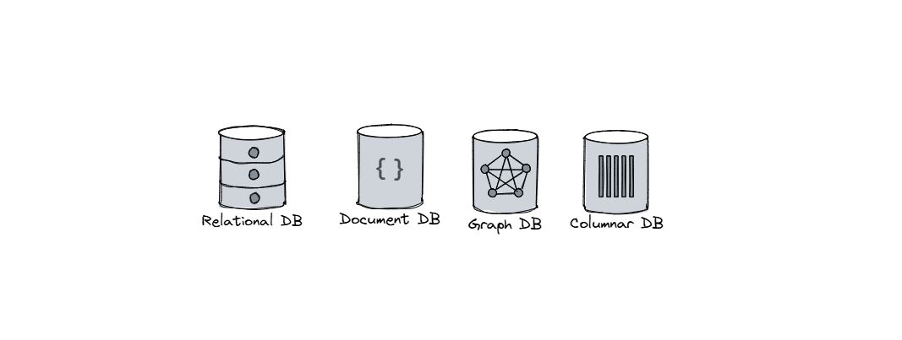

# Database

### What is Database?
A database is an organized collection of logically related information that is structured to be easily accessible , manageable, and updateble. Databases are typically controlled by a Database Management System (DBMS), Which enables users and application to interact with the stored data efficiently.

### What is DBMS?
A Database Management System (DBMS) is integrated software that allows users to create, modify, manage and retrive data from database and end-users or applications, providing core facilities core facilities for data storage, querying, administration, and security.

## Types of Database

- Relational Database ([MySQL](https://www.mysql.com/), [PostgreSQL](https://www.postgresql.org/) ,[SQLite](https://sqlite.org/), [Supabase](https://supabase.com))
- NoSQL Database
    - Document ( [MongoDB](https://www.mongodb.com/), [Firebase](https://firebase.google.com/) )
    - Key-value ( [Redis](https://redis.io/) )
    - Graph ( [Neo4j](https://neo4j.com/) )
    - Timeseries ( [Prometheus](https://prometheus.io/)  )
    - wide column ( [Apache Cassandra](https://cassandra.apache.org/_/index.html) )
    

## Relational Database

A Relational database is a collection of data items with pre-defined relationships between them. These items are organised as a set of tables with columns and rows.The core idea is that data points are related to one another through shared values, typically using keys -- such as primary keys and foreign keys to establish relationships between different tables

Relational databases use Structured Query Language (SQL) for defining, querying, and manipulating data. They are highly valued for their consistency, data integrity, and support for complex queries, making them widely used in business, finance, and other applications where relationships between data points are essential

#### Advantages

- Strong data integrity and consistency.

- Supports complex queries and data relationships.

- Standardized query language (SQL) and mature security features.

- Well-suited for structured data and transactional applications.

#### Disadvantages

- Limited scalability, especially with very large or rapidly growing data.

- Rigid schema makes adapting to changing requirements difficult.

- Not ideal for unstructured or semi-structured data.

- Can be complex and costly to design, maintain, and optimize

## Non-relational database
A non-relational database, also known as a NoSQL database, is a type of database that stores data in formats other than the traditional tabular structure used by relational databases. Instead of organizing data into rows and columns, non-relational databases use flexible data models such as documents, key-value pairs, graphs, or columns

### Key Characteristic

- **Flexible Schema**: Non-relational databases do not require a fixed schema, allowing data with different structures to coexist and making it easy to adapt as requirements change.

- **Support for Unstructured and Semi-Structured Data**: They are designed to efficiently handle unstructured (like social media posts) and semi-structured data (like sensor logs), which are difficult to manage in relational databases.

- **Horizontal Scalability**: These databases are built to scale out across multiple servers, making them suitable for handling large volumes of diverse and rapidly changing data.

- **Variety of Data Models**: Common types include:

    - Document databases (e.g., MongoDB) for storing data as flexible JSON-like documents.

    - Key-value stores (e.g., Redis, DynamoDB) for fast retrieval using simple key-value pairs.

    - Column-family stores (e.g., Cassandra) for handling large, distributed datasets.

    - Graph databases (e.g., Neo4j) for managing complex relationships between data points

#### Advantages

- Highly scalable and handles large volumes of data efficiently.

- Flexible schema supports unstructured and semi-structured data.

- Fast performance for specific use cases (e.g., big data, real-time analytics).

- Easier horizontal scaling and distributed architecture.

#### Disadvantages

- Weaker data consistency and integrity compared to relational databases.

- Limited support for complex queries and joins.

- Lack of standardization and mature tooling.

- Can have a steeper learning curve for those used to SQL

## When to use SQL vs NoSQL

#### When to Use Relational Databases (SQL)
Relational databases are best suited for scenarios where:

- **Data Consistency and Integrity Are Critical**: Applications like banking, finance, healthcare, and e-commerce require strict data accuracy, consistency, and transactional reliability (ACID compliance).

- **Structured Data**: The data has a clear, tabular structure with well-defined relationships, such as customer records, transactions, inventory, or employee data.

- **Complex Queries and Reporting**: When you need to perform complex queries, joins, and aggregations, relational databases with SQL provide powerful and standardized query capabilities.

- **Transactional Systems**: Systems that process many transactions and require rollback or recovery in case of failures, such as order processing, payment systems, and inventory management.

- **Regulatory Compliance**: Environments where auditability, data integrity, and traceability are required, such as healthcare and finance.

#### Common Use Cases:

- Banking and financial systems

- E-commerce order and inventory management

- Healthcare patient records

- Human resources and CRM systems

- Content management with versioning and access control

#### When to Use Non-Relational (NoSQL) Databases
Non-relational databases are ideal for situations where:

- **Scalability Is a Priority**: Applications that need to scale horizontally to handle large volumes of data or high-velocity workloads, such as big data analytics, IoT, and social media platforms.

- **Flexible or Evolving Schema**: When the data structure is dynamic, semi-structured, or unstructured, and may change frequently, NoSQL databases offer schema flexibility.

- **High-Speed Processing**: Use cases that require fast, real-time data ingestion and retrieval, such as caching, personalization, and session management.

- **Handling Large and Diverse Data Sets**: Applications dealing with massive, diverse, or rapidly changing data, like sensor data, logs, or multimedia content.

- **Distributed or Cloud-Native Architectures**: When you need to distribute data across multiple locations or cloud environments for high availability and fault tolerance

#### Common Use Cases:

- Real-time analytics and dashboards

- IoT data collection

- Social networks and messaging apps

- Content delivery and media storage

- Caching and session storage