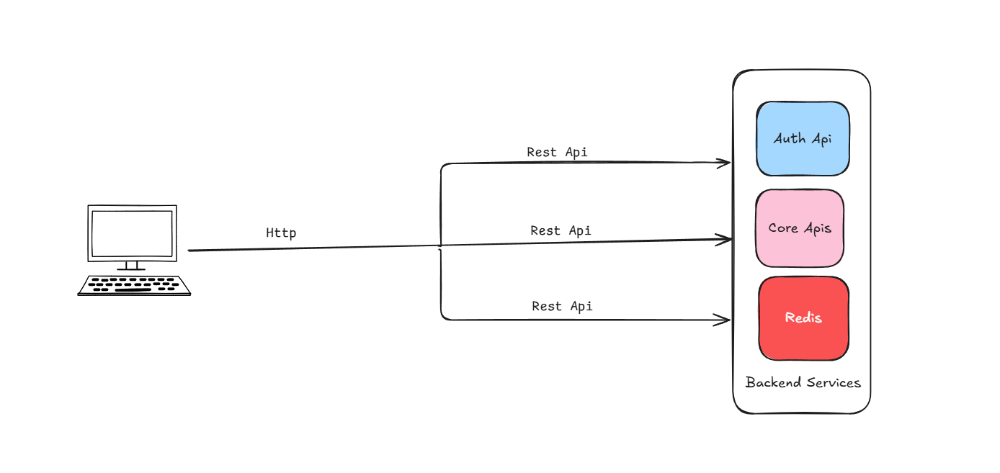
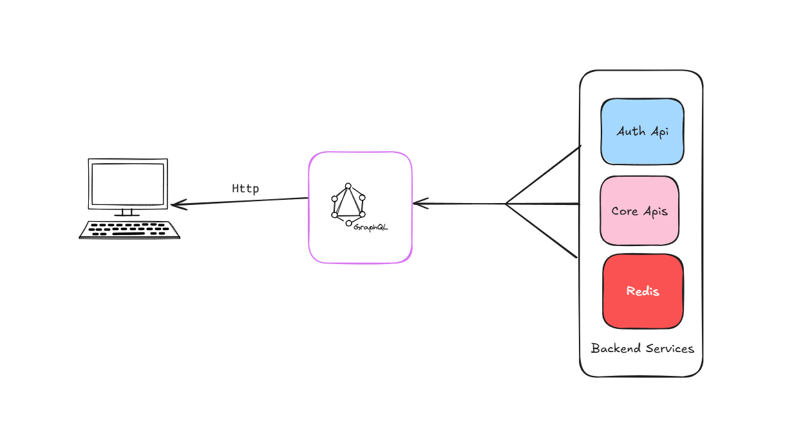

# Table of content 
  - [REST vs GraphQL vs GRPC ](#REST-API)

  - [Web Socket vs AMQP](#WebSocket-vs-AMQP)

  - [HTTP methods: GET, POST, PUT, DELETE](#HTTP-Methods)

  - [Status codes (200, 400, 401, 404, 500)](#Http-status-Code)

  - [Idempotation](#Idempotation)

  - [API versioning](#API-Versioning)
# REST vs GraphQL vs GRPC
<br/>

## REST API
Okay, imagine you have a database of products, right? Like phones, laptops, all that stuff. Now you want your website or mobile app to talk to that database — but obviously, you don’t want to give direct access. That’s risky.

So instead, you create an API — it’s like a middleman. And when it follows certain rules using standard HTTP stuff — like GET, POST, PUT, DELETE — we call it a REST API.
<br/>


###  What is a REST API?

REST (Representational State Transfer) is an architectural style for building web services that use standard HTTP methods (GET, POST, PUT, DELETE) to perform CRUD operations on resources.

A REST API allows clients (browsers, mobile apps, other servers) to interact with data stored on a server via HTTP endpoints.
<br/>

### How it works 
Let’s say you want to get a list of all products. You just send a GET request to /products, and boom — the API responds with a list in JSON format.

Wanna add a new product? You send a POST request to /products with product data.
Need to update one? Use PUT /products/5.
Want to delete one? DELETE /products/5.

It's just URLs + HTTP methods — that's it!
<br/>

### So when should you actually use REST?
If you’re building something like:
- a blog
- an e-commerce backend
- an admin dashboard
- a public API for others to use

then REST is a perfect fit.


------------------------------------------------------

## GraphQL

###  First, what is GraphQL?
GraphQL is basically a new way of asking for data from your backend. It was created by Facebook because REST was getting annoying for big apps like Facebook itself.

You know how in REST, you hit /products and you get a whole product object whether you want all of it or not? And then if you want related stuff — like reviews or seller info — you have to make multiple requests? That’s the pain point GraphQL fixes.

With GraphQL, you just send one request, and inside that, you tell it exactly what data you want — nothing more, nothing less.

```json
{
  "product": {
    "id": "123",
    "name": "iPhone 15",
    "price": 999,
    "seller": {
      "id": "9",
      "name": "Apple"
    }
  }
}

```
In REST:
You probably do something like:

1. GET /products/123

2. Then GET /sellers/9

In GraphQL:
One query. One request.
``` graphql
{
  product(id: "123") {
    id
    name
    price
    seller {
      id
      name
    }
  }
}

```

### Advantages
- No over-fetching. No under-fetching. Just the exact fields you want.
- In REST, you might need 3-4 requests to build one screen. In GraphQL, one query can get it all.
- GraphQL has this thing called introspection, which means tools like GraphiQL or Apollo Studio can show you everything your API can do — without needing Swagger or Postman.
- Every GraphQL API has a schema — so you know what types are returned, what’s optional, what’s required, etc. Super nice for autocompletion and debugging.

### Disadvantages
 - With REST, you can easily cache GET /products/123. In GraphQL, caching is harder because every query can look different.
 - If you let users query everything deeply nested, it can hit your DB hard. You need rate limiting, depth limiting, and maybe query complexity checks.
 - REST: define some routes and controllers.
GraphQL: define schemas, resolvers, types, etc. Not hard, just a bit more upfront work.

-------------------------------
## GRPC
So you know how REST uses HTTP and JSON?
gRPC is like the high-performance version of that — built by Google.

Instead of sending text like JSON, it sends binary data using Protocol Buffers (proto files). Way faster, smaller, and great for internal services or microservices.

### 🔧 How it works:
You define your service in a .proto file:

```proto
service UserService {
  rpc GetUser (UserRequest) returns (UserResponse);
}
```
1. You generate code in any language (Go, Node, Java, etc.)
2. You call methods directly — like you're calling a function — no need to build URLs or handle HTTP manually.
<br/>

### ✅ Advantages
- Super fast (binary > JSON)

- Auto code generation for client & server

- Built-in support for streaming

- Great for microservices or real-time comms
<br/>

### ❌ Disadvantages
- If you're building a public API — REST is easier to consume

- Not easily testable in browser (needs special tools)

- Harder to debug compared to REST or GraphQL
<br/>

###  When to use:
- Service-to-service communication

- Real-time systems

- Internal systems where you want max speed
<br/>

**So REST is easy, GraphQL is flexible, and gRPC is fast?**


# WebSocket vs AMQP
## What is Web socket?
Unlike REST (request → response), WebSocket is a 2-way communication channel between client and server.

Once connected, both sides can send data anytime — no need to wait for a request.

Think of it like:

REST is like calling customer care every time you need info.
WebSocket is like staying on a call — you talk whenever.

### How to use
1. Client opens a connection:
```js
const socket = new WebSocket("wss://example.com/socket");
```
2. Server accepts it and both stay connected.
3. Now they can send/receive messages instantly.
<br/>

### When to use ?
- Real-time chat apps 

- Live notifications 

- Multiplayer games 

- Stock price updates 
<br/>

### When not to use?
- For simple CRUD or static data — REST is better

- If you don’t need live updates — it’s overkill

- Needs more setup: connection handling, retries, etc.
<br/>

-------------------------------
## AMQP stands for Advanced Message Queuing Protocol.
It’s a protocol that lets services send messages to each other asynchronously, using queues.
The most popular tool that uses AMQP? 👉 
<br/>

### How it works
Let’s say:

- Service A → processes user signup
- Service B → sends a welcome email

With AMQP:

- A sends a message: “New user signed up”
- B listens to that queue and sends the email

They don’t talk directly — the message broker (like RabbitMQ) handles delivery.
<br/>

### when to use 
- Decouples services (less tightly connected)
- Great for background tasks (emails, logs, billing)
- Built-in retry, acknowledgement, durability
- Handles spikes in traffic easily
<br/>

### Wnen not to use
- When you need real-time 2-way comms → use WebSocket
- For simple request/response → use REST
- Setup is a bit more involved (need RabbitMQ server, etc.)
<br/>


# HTTP Methods
| Method      | Purpose             | Description                                  | Idempotent | Safe  |
| ----------- | ------------------- | -------------------------------------------- | ---------- | ----- |
| **GET**     | Read/Retrieve data  | Fetches data from the server                 | ✅ Yes      | ✅ Yes |
| **POST**    | Create new data     | Sends data to the server to create something | ❌ No       | ❌ No  |
| **PUT**     | Update/Replace data | Replaces the entire resource                 | ✅ Yes      | ❌ No  |
| **PATCH**   | Update/Modify data  | Partially updates a resource                 | ❌ No       | ❌ No  |
| **DELETE**  | Delete data         | Removes a resource                           | ✅ Yes      | ❌ No  |
| **HEAD**    | Headers only        | Same as GET but returns only headers         | ✅ Yes      | ✅ Yes |
| **OPTIONS** | Check capabilities  | Tells which methods are supported            | ✅ Yes      | ✅ Yes |


# Http status Code
### 1. 1xx – Informational

| Code | Meaning             | Use Case Example                     |
| ---- | ------------------- | ------------------------------------ |
| 100  | Continue            | Server says: "Got it, keep going..." |
| 101  | Switching Protocols | Used in WebSocket handshakes         |

### 2. 2xx – Success
| Code | Meaning    | Use Case Example                                   |
| ---- | ---------- | -------------------------------------------------- |
| 200  | OK         | Standard success response                          |
| 201  | Created    | New resource created (e.g., after POST)            |
| 204  | No Content | Success, but no response body (e.g., after DELETE) |


### 3.  3xx – Redirection
| Code | Meaning           | Use Case Example                          |
| ---- | ----------------- | ----------------------------------------- |
| 301  | Moved Permanently | Redirect to new URL (SEO friendly)        |
| 302  | Found (Temporary) | Redirect to another URL temporarily       |
| 304  | Not Modified      | Used for caching — no changes to resource |


### 4. 4xx – Client Errors
| Code | Meaning              | Use Case Example                       |
| ---- | -------------------- | -------------------------------------- |
| 400  | Bad Request          | Invalid data sent by the client        |
| 401  | Unauthorized         | No or bad auth token                   |
| 403  | Forbidden            | Authenticated but no access rights     |
| 404  | Not Found            | Resource doesn’t exist                 |
| 409  | Conflict             | Duplicate data or conflict in resource |
| 422  | Unprocessable Entity | Valid JSON, but invalid fields         |


### 5xx – Server Errors
| Code | Meaning               | Use Case Example                        |
| ---- | --------------------- | --------------------------------------- |
| 500  | Internal Server Error | Generic failure — usually a bug         |
| 502  | Bad Gateway           | Server got a bad response from upstream |
| 503  | Service Unavailable   | Server down or overloaded               |
| 504  | Gateway Timeout       | Upstream server didn’t respond in time  |

-------------------------------
# Idempotation

 Idempotency means:

> “No matter how many times you make the same request, the result will be the same.”

It’s like pressing a light switch:
- If it’s already ON, pressing ON again doesn’t change anything — that’s idempotent.
- But if each press made the light brighter, that’s not idempotent.

-------------------------------

# API Versioning

Say you built an API and clients are using it.
Now you want to:

- change a response format
- rename a field
- add required parameters

If you do it directly, boom 💥 — things break for existing clients.
Versioning lets you ship changes without ruining what’s already out there.

## Api versioning methods
| Style                            | Example                                      | Notes                               |
| -------------------------------- | -------------------------------------------- | ----------------------------------- |
| **URI versioning** (most common) | `/api/v1/users`                              | Easy to read, version is explicit   |
| **Header versioning**            | `Accept: application/vnd.api+json;version=2` | Clean URLs, but harder to debug     |
| **Query param**                  | `/users?version=2`                           | Quick for testing, not very RESTful |
| **Subdomain**                    | `v1.api.example.com`                         | Not common but works                |


##  When to bump a version?
- Breaking changes (e.g. field removed/renamed) ✅
- Major behavior change ✅
- Adding new fields or endpoints? ❌ (usually doesn’t need a version bump)